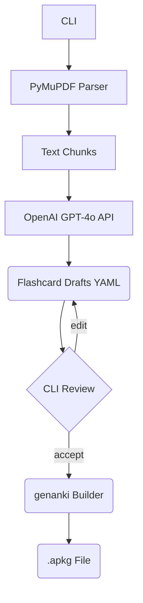

# Produkt-Requirements-Dokument (PRD)

## 1. Überblick

**Produktname:** PDF‑to‑Anki Flashcard Generator
**Kurzbeschreibung:** Ein reines CLI‑Tool, das Vorlesungsskripte im PDF‑Format automatisiert in qualitativ hochwertige Anki‑Flashcards (.apkg) umwandelt. Es nutzt PyMuPDF zum PDF‑Parsing, einen Openrouter‑LLM für die Inhaltsextraktion und ‑generierung und rendert LaTeX‑Formeln direkt in den Karten via eingebettetem MathJax, bevor die Karten mit *genanki* paketiert werden.

## 2. Ziel & Erfolgskriterien

| Ziel                                         | Metrik                            | Zielwert |
| -------------------------------------------- | --------------------------------- | -------- |
| Reduzierter Aufwand für Flashcard‑Erstellung | Zeitersparnis pro 100 Slides      | ≥ 85 %   |
| Inhaltliche Richtigkeit                      | Stichproben‑Fehlerquote in Karten | ≤ 5 %    |
| Lernwirksamkeit                              | Ø Wiedererkennung nach 1 Woche    | ≥ 80 %   |
| Nutzerzufriedenheit                          | CSAT                              | ≥ 4/5    |

## 3. Hintergrund & Motivation

Studierende investieren viel Zeit in das manuelle Erstellen von Lernkarten. Ein automatisiertes CLI‑Tool reduziert diesen Aufwand drastisch und liefert konsistente Ergebnisse. Die Entscheidung, ausschließlich den OpenAI‑Endpoint zu verwenden (statt lokaler Modelle), senkt die Einstiegshürde und verkürzt die Entwicklungszeit.

## 4. Nutzerbedürfnisse & Personas

| Persona                  | Bedürfnis                   | „Job to be Done“                                                                     |
| ------------------------ | --------------------------- | ------------------------------------------------------------------------------------ |
| Lisa (Bachelor Biologie) | Schnell Lernkarten aus PDFs | „Wenn ich ein neues Skript bekomme, möchte ich es direkt als Anki‑Deck üben können.“ |
| Max (Mediziner)          | Offline‑speicherbare Decks  | „Ich will das Deck als .apkg herunterladen und auf jedem Gerät importieren können.“  |

> **Abgrenzung:** Kein Mehrbenutzer‑/Cloud‑Account‑System in v1; Fokus auf Single‑User‑CLI.

## 5. Funktionale Anforderungen

**F1 PDF‑Import**
• Unterstützt reguläre & gescannte PDFs (OCR via Tesseract optional)
• Stapelverarbeitung mehrerer PDFs

**F2 Text‑Segmentierung**
• Logische Chunks (300–500 Tokens)
• Überschriften‑Erkennung zur Deck‑Strukturierung

**F3 KI‑gestützte Flashcard‑Generierung**
• Kartentypen: „Frage/Antwort“, „Cloze Deletion“
• Prompt‑Vorlagen konfigurierbar
• Openrouter API (kein On‑Device LLM)

**F4 MathJax‑Rendering**
• LaTeX‑Inline‑ und Display‑Formeln werden in HTML‑Karten mit MathJax v3 gerendert
• Fallback als PNG, falls Anki‑MathJax‑Plugin fehlt (Option)

**F5 Review‑Layer (optional CLI‑basierend)**
• Karten im Terminal listen, Batch‑Accept/Reject, YAML‑Export für externe Editoren

**F6 Export**
• .apkg via *genanki* inkl. eingebetteter Bilder & Formeln
• Deck‑Struktur: Hauptdeck → Kapitel‑Subdecks

## 6. Nicht‑funktionale Anforderungen

| Kategorie      | Anforderung                                                  |
| -------------- | ------------------------------------------------------------ |
| Performance    | ≤ 20 min für 100‑seitiges PDF (Consumer‑Laptop)              |
| Datenschutz    | Uploads nur an OpenAI‑API; keine Speicherung sensibler Daten |
| Fehlertoleranz | Resumable Jobs; Log‑Files                                    |
| I18n           | UTF‑8‑Unterstützung; mehrsprachige PDFs                      |

## 7. User Journey (Happy Path)

1. **PDF(s) auswählen** – Pfad(e) via CLI‐Argument
2. **Parameter setzen** – z. B. Chunk‑Größe, Kartentyp, Prompt‑Preset
3. **Generieren** – Fortschrittsinfo in der Konsole
4. **Review (optional)** – `anki-cli review deck.yaml`
5. **Export** – .apkg‑Datei wird erzeugt

## 8. Systemarchitektur (High Level)

## 9. Haupt‑Technologien

| Layer          | Tech‑Stack                               |
| -------------- | ---------------------------------------- |
| PDF‑Parsing    | Python 3.12, PyMuPDF (fitz), pytesseract |
| KI‑Backend     | OpenAI GPT‑4o (Official SDK)             |
| Math‑Rendering | MathJax v3 (embedded in card HTML)       |
| Packager       | genanki 0.12                             |
| CLI            | Click or Typer                           |
| Packaging      | Poetry + Dockerfile                      |

## 10. Schnittstellen & APIs

| API        | Zweck                           |
| ---------- | ------------------------------- |
| Openrouter | LLM‑Requests (API‑Key benötigt) |

## 11. Abgrenzung (Out of Scope v1)

* Keine GUI/Electron‑App.
* Kein Mehrbenutzer‑ oder Cloud‑Sync.
* Kein On‑Device‑LLM‑Fallback.

## 12. Zeitplan & Milestones (T‑0 = Projektstart)

| Meilenstein       | Inhalt                              | Datum |
| ----------------- | ----------------------------------- | ----- |
| MS1 (2 Wo)        | PoC: PDF → Text → 10 Karten CLI     |       |
| MS2 (4 Wo)        | Prompt‑Tuning & Cloze, .apkg Export |       |
| MS3 (6 Wo)        | MathJax‑Rendering & Review‑Flow     |       |
| Release v1 (8 Wo) | Stable CLI + Dokumentation          |       |

## 13. Risiken & Gegenmaßnahmen

| Risiko                    | Wahrscheinlichkeit | Impact | Mitigation                         |
| ------------------------- | ------------------ | ------ | ---------------------------------- |
| LLM‑Halluzinationen       | mittel             | hoch   | Review‑Layer, Prompt‑Guardrails    |
| API‑Kosten                | mittel             | mittel | Token‑Budgetierung, Batch‑Requests |
| Fehlerhafte LaTeX‑Formeln | mittel             | mittel | Pre‑Parser, Formel‑Validator       |

## 14. Akzeptanzkriterien

* 100‑seitiges deutschsprachiges PDF erzeugt ≤ 500 Karten mit korrekter Deck‑Hierarchie.
* LaTeX‑Formeln werden im Anki‑Frontend korrekt via MathJax gerendert.
* Test‑Suite (≥ 80 % Coverage) läuft grün.

---

*Letzte Aktualisierung: 21. Mai 2025*
